### 🗓️ 제출물 체크리스트
- [X] **[빌드 & 실행 방법](#빌드--실행-방법)** 섹션을 참조하세요.
- [X] **[REST API 명세](#rest-api-명세)** 섹션에서 모든 엔드포인트, 파라미터, 응답 예시를 확인할 수 있습니다.
- [X] **[테스트 성공 확인](#테스트-성공-확인)** 섹션을 참조하세요.
- [X] **[Swagger UI 및 OpenAPI 문서](#swagger-ui-및-openapi-문서)** 섹션을 참조하세요.

# Holiday Service

전 세계 공휴일 데이터를 관리하는 REST API 서비스입니다.
외부 API로부터 최근 5년(2020-2025) 공휴일 데이터를 수집하고, 다양한 조건으로 검색할 수 있습니다.

## 프로젝트 개요

### 핵심 특징

- **단일 서버 환경**: 분산 락 없이 동작하도록 설계
- **Job 단위 관리**: 여러 담당자의 동시 작업으로 인한 데이터 정합성 문제를 Job 단위로 제어
- **멱등성 보장**: 삭제 및 덮어쓰기 API는 멱등성을 지켜 깨진 데이터 정합성 복구 가능
- **물리 삭제 전략**: 외부 API를 단일 진실 원천(Single Source of Truth)으로 간주하여 물리 삭제 후 재동기화

### 설계 철학

#### 1. 데이터 정합성 관리

단일 서버 환경에서 여러 담당자가 동시에 등록/수정/삭제를 수행할 수 있어, **Job 단위로 작업을 제어**하여 데이터 정합성을 보장합니다.

- Job이 실행 중일 때는 다른 삭제/덮어쓰기 작업을 차단
- `SyncJobValidator`를 통한 중앙화된 검증 로직

#### 2. 멱등성 설계

삭제 및 덮어쓰기 API는 **멱등성**을 보장하여, 깨진 데이터 정합성을 안전하게 복구할 수 있습니다.

- 동일한 요청을 여러 번 실행해도 결과가 동일
- 네트워크 재시도나 관리자의 수동 복구 작업에도 안전

#### 3. 물리 삭제 전략

외부 API를 **단일 진실 원천(Single Source of Truth)**으로 간주합니다.

- **Soft Delete 대신 물리 삭제**: 외부 API 데이터와 일치시키는 것이 목적
- 데이터 불일치 시 물리 삭제 후 외부 API에서 재동기화
- 히스토리 추적은 `sync_history` 테이블에서 관리

## 기술 스택

- **Java 21**
- **Spring Boot 4.0.0**
- **Spring Data JPA** - 영속성 관리
- **QueryDSL** - 동적 쿼리
- **H2 Database** - 인메모리 데이터베이스
- **Lombok** - 보일러플레이트 코드 제거
- **Springdoc OpenAPI** - API 문서화

### Application Service 계층 설계

Application Service 계층을 **책임별로 명확히 분리**하여 유지보수성과 테스트 용이성을 향상시켰습니다.

#### Service 구조

```
application/service/
├── HolidayAsyncService          # 병렬 업로드 오케스트레이션
├── HolidayManagementService     # 공휴일 삭제/덮어쓰기
├── HolidaySearchService         # 공휴일 검색
├── HolidaySyncInnerService      # 외부 API 호출 + 저장 (내부용)
├── ExternalApiService           # 외부 API 호출 (공개 UseCase)
├── SyncJobValidator             # Job 상태 검증
└── CheckInitialSystemLoadService # 시스템 초기화 체크
```

#### 책임 분리 원칙

| Service | 책임 | Use Cases |
|---------|------|-----------|
| **HolidayAsyncService** | 병렬 업로드 오케스트레이션<br/>CompletableFuture 관리<br/>여러 국가/연도 병렬 처리 | `UploadHolidaysUseCase` |
| **HolidayManagementService** | 공휴일 삭제 및 덮어쓰기<br/>트랜잭션 관리 (DB 작업만) | `DeleteHolidaysUseCase`<br/>`RefreshHolidaysUseCase` |
| **HolidaySearchService** | 공휴일 검색 및 조회 | `SearchHolidaysUseCase` |
| **ExternalApiService** | 외부 API 호출 (공개)<br/>국가 조회 포함 | `FetchHolidaysUseCase` |
| **HolidaySyncInnerService** | 외부 API 호출 + 저장 (내부)<br/>동기화 이력 기록 | (내부 전용) |
| **SyncJobValidator** | Job 실행 상태 검증<br/>중복 실행 방지 | (유틸리티) |

#### 트랜잭션 최적화

**트랜잭션 범위를 최소화**하여 DB 커넥션 효율성을 높였습니다.

**Before (비효율적):**
```
Service (@Transactional)
  ├─ 외부 API 호출 (느림) ← 트랜잭션 안에 포함
  └─ DB 저장
```

**After (최적화):**
```
Controller
  └─ 외부 API 호출 (느림) ← 트랜잭션 밖

Service (@Transactional)
  └─ DB 작업만 ← 트랜잭션 최소화
```

## ERD (Entity Relationship Diagram)

```mermaid
erDiagram
    COUNTRY ||--o{ HOLIDAY : has
    COUNTRY {
        string country_code PK "국가 코드 (ISO 3166-1 alpha-2)"
        string name "국가 이름"
    }

    HOLIDAY {
        bigint holiday_id PK "공휴일 ID"
        string country_code FK "국가 코드"
        string local_name "현지 이름"
        string name "영문 이름"
        date date "공휴일 날짜"
        boolean fixed "고정 휴일 여부"
        boolean global "전역 휴일 여부"
        integer launch_year "휴일 시작 연도"
    }

    SYNC_JOB ||--o{ SYNC_HISTORY : has
    SYNC_JOB {
        bigint job_id PK "Job ID"
        string execution_type "실행 타입"
        string status "Job 상태"
        timestamp start_time "시작 시간"
        timestamp end_time "종료 시간"
    }

    SYNC_HISTORY {
        bigint history_id PK "이력 ID"
        bigint job_id FK "Job ID"
        string country_code "국가 코드"
        integer year "연도"
        string status "동기화 상태"
        string error_message "에러 메시지"
        timestamp created_at "생성 시간"
    }
```



### 주요 테이블 설명

#### 1. `country` - 국가 정보

- 외부 API에서 제공하는 국가 목록
- 시스템 최초 적재 시 자동으로 저장
- 국가 코드는 ISO 3166-1 alpha-2 표준 (예: KR, US, JP)

#### 2. `holiday` - 공휴일 정보

- 각 국가의 공휴일 데이터
- 복합 인덱스 (`idx_holiday_country_date`)를 통한 검색 최적화
- `year` 컬럼 없이 `date`에서 년도 추출 (정규화)

#### 3. `sync_job` - 동기화 Job 관리

- 비동기 업로드 작업의 전체 실행 단위
- `RUNNING` 상태인 Job이 있으면 다른 삭제/덮어쓰기 차단
- Job 단위로 데이터 정합성 관리

#### 4. `sync_history` - 동기화 이력

- 각 국가-연도별 동기화 결과 기록
- 성공/실패 추적 및 에러 메시지 저장
- 물리 삭제로 인한 데이터 손실을 이력으로 보완

## 빌드 & 실행 방법

### 1. 사전 요구사항

- Java 21 이상
- Gradle 7.x 이상

### 2. 프로젝트 클론

```bash
git clone https://github.com/uhanuu/planit-square.git
cd mini-service
```

### 3. 빌드

```bash
# 클린 빌드
./gradlew clean build

# 테스트 제외 빌드
./gradlew clean build -x test
```

### 4. 실행

```bash
# 개발 서버 실행
./gradlew bootRun

# 또는 JAR 파일 실행
java -jar build/libs/mini-service-0.0.1-SNAPSHOT.jar
```

## 테스트 성공 확인


```bash
./gradlew clean test
```

테스트 실행 후 다음 위치에서 리포트 확인:
```
build/reports/tests/test/index.html
```


## REST API 명세

### 엔드포인트 목록

| Method | Endpoint | 설명 |
|--------|----------|------|
| `POST` | `/api/v1/holidays` | 공휴일 데이터 업로드 (병렬처리) |
| `PUT` | `/api/v1/holidays` | 공휴일 데이터 덮어쓰기 |
| `DELETE` | `/api/v1/holidays/{year}/{countryCode}` | 공휴일 데이터 삭제 |
| `GET` | `/api/v1/holidays` | 공휴일 검색 (페이징) |

---

### 1. 공휴일 업로드 API

**Endpoint:** `POST /api/v1/holidays`

**설명:** 외부 API로부터 지정된 연도까지의 최근 5년 공휴일 데이터를 병렬로 업로드합니다.

**Request Body:**

```json
{
  "year": 2025
}
```

**Parameters:**

| Field | Type | Required | Description |
|-------|------|----------|-------------|
| `year` | Integer | Yes | 업로드할 종료 연도 (예: 2025 입력 시 2021-2025 업로드) |

**Response:**

- **200 OK** - 업로드 완료

**Example:**

```bash
curl -X POST "http://localhost:8080/api/v1/holidays" \
  -H "Content-Type: application/json" \
  -d '{"year": 2025}'
```

**특징:**
- 여러 국가를 병렬로 처리하여 성능 최적화
- Job 단위로 실행되며, `sync_job` 테이블에서 진행 상황 확인 가능
- CompletableFuture를 활용한 동시성 제어

---

### 2. 공휴일 덮어쓰기 API

**Endpoint:** `PUT /api/v1/holidays`

**설명:** 특정 연도와 국가의 공휴일을 외부 API에서 다시 조회하여 덮어씁니다. (멱등성 보장)

**Request Body:**

```json
{
  "year": 2024,
  "countryCode": "KR"
}
```

**Parameters:**

| Field | Type | Required | Description |
|-------|------|----------|-------------|
| `year` | Integer | Yes | 덮어쓸 연도 |
| `countryCode` | String | Yes | 국가 코드 (ISO 3166-1 alpha-2) |

**Response:**

```json
{
  "deleteCount": 15,
  "insertCount": 16
}
```

**Example:**

```bash
curl -X PUT "http://localhost:8080/api/v1/holidays" \
  -H "Content-Type: application/json" \
  -d '{"year": 2024, "countryCode": "KR"}'
```

**특징:**
- **멱등성 보장**: 동일 요청을 여러 번 실행해도 결과 동일
- 트랜잭션 최적화: 외부 API 호출은 트랜잭션 밖에서 수행
- 실행 중인 Job이 있으면 `409 Conflict` 반환

---

### 3. 공휴일 삭제 API

**Endpoint:** `DELETE /api/v1/holidays/{year}/{countryCode}`

**설명:** 특정 연도와 국가의 공휴일을 물리 삭제합니다. (멱등성 보장)

**Path Parameters:**

| Parameter | Type | Required | Description |
|-----------|------|----------|-------------|
| `year` | Integer | Yes | 삭제할 연도 |
| `countryCode` | String | Yes | 국가 코드 (ISO 3166-1 alpha-2) |

**Response:**

```json
{
  "deletedCount": 15
}
```

**Example:**

```bash
curl -X DELETE "http://localhost:8080/api/v1/holidays/2024/KR"
```

**특징:**
- **물리 삭제**: Soft Delete 없이 완전히 제거
- **멱등성 보장**: 이미 삭제된 데이터 재요청 시 `deletedCount: 0` 반환
- 실행 중인 Job이 있으면 `409 Conflict` 반환

---

### 4. 공휴일 검색 API

**Endpoint:** `GET /api/v1/holidays`

**설명:** 다양한 조건으로 공휴일을 검색하고 페이징 처리된 결과를 반환합니다.

**Query Parameters:**

| Parameter | Type | Required | Description | Example |
|-----------|------|----------|-------------|---------|
| `year` | Integer | No | 연도 필터 | 2024 |
| `countryCode` | String | No | 국가 코드 (ISO 3166-1 alpha-2) | KR, US, JP |
| `from` | Date | No | 시작일 (yyyy-MM-dd) | 2024-01-01 |
| `to` | Date | No | 종료일 (yyyy-MM-dd) | 2024-12-31 |
| `type` | String | No | 공휴일 타입 | PUBLIC, BANK, OPTIONAL |
| `name` | String | No | 공휴일 이름 검색 (부분 일치) | 설날, New Year |
| `page` | Integer | No | 페이지 번호 (0-based, 기본값: 0) | 0 |
| `size` | Integer | No | 페이지 크기 (기본값: 20) | 20 |
| `sort` | String | No | 정렬 조건 (field,direction) | date,asc |

**정렬 가능 필드:**
- `date` - 날짜 기준 정렬
- `name` - 이름 기준 정렬
- `country` - 국가 코드 기준 정렬

**Response:**

```json
{
  "content": [
    {
      "id": 1,
      "countryCode": "KR",
      "countryName": "대한민국",
      "localName": "설날",
      "name": "New Year's Day",
      "date": "2024-01-01",
      "fixed": true,
      "global": true,
      "launchYear": 2021,
      "types": ["Public"],
      "applicableRegions": []
    }
  ],
  "pageable": {
    "pageNumber": 0,
    "pageSize": 20
  },
  "totalElements": 100,
  "totalPages": 5,
  "last": false,
  "first": true
}
```

**사용 예시:**

```bash
# 1. 기본 검색 (전체 공휴일)
curl -X GET "http://localhost:8080/api/v1/holidays?page=0&size=20"

# 2. 연도별 검색
curl -X GET "http://localhost:8080/api/v1/holidays?year=2024"

# 3. 국가별 검색
curl -X GET "http://localhost:8080/api/v1/holidays?countryCode=KR"

# 4. 연도 + 국가 검색
curl -X GET "http://localhost:8080/api/v1/holidays?year=2024&countryCode=KR"

# 5. 날짜 범위 검색
curl -X GET "http://localhost:8080/api/v1/holidays?from=2024-01-01&to=2024-06-30"

# 6. 공휴일 이름 검색
curl -X GET "http://localhost:8080/api/v1/holidays?name=설날&countryCode=KR"

# 7. 타입별 검색
curl -X GET "http://localhost:8080/api/v1/holidays?type=PUBLIC&countryCode=US"

# 8. 정렬 (날짜 내림차순)
curl -X GET "http://localhost:8080/api/v1/holidays?year=2024&sort=date,desc"

# 9. 복합 조건 검색 + 페이징
curl -X GET "http://localhost:8080/api/v1/holidays?year=2024&countryCode=KR&type=PUBLIC&page=0&size=10&sort=date,asc"
```

---

## Swagger UI 및 OpenAPI 문서

### Swagger UI 접근 방법

애플리케이션 실행 후 브라우저에서 다음 URL에 접속하여 대화형 API 문서를 확인할 수 있습니다:

**주소:**
```
http://localhost:8080/swagger-ui.html
```

또는

```
http://localhost:8080/swagger-ui/index.html
```

**Swagger UI 주요 기능:**

1. **API 엔드포인트 목록**: 모든 REST API 엔드포인트를 그룹별로 확인
2. **파라미터 확인**: 각 API의 요청 파라미터 및 타입 정보
3. **응답 스키마**: 성공/실패 시 응답 구조 및 예시
4. **Try it out**: 브라우저에서 직접 API 테스트 실행
5. **Request/Response 예시**: 실제 요청/응답 데이터 확인

**사용 방법:**

1. Swagger UI 페이지 접속
2. 원하는 API 엔드포인트 클릭하여 펼치기
3. **Try it out** 버튼 클릭
4. 필요한 파라미터 입력
5. **Execute** 버튼으로 실행
6. 응답 결과 확인 (Status Code, Response Body)

### OpenAPI 스펙 확인

OpenAPI 3.0 표준 스펙 문서를 JSON 또는 YAML 형식으로 확인할 수 있습니다.

**JSON 형식:**
```
http://localhost:8080/v3/api-docs
```

**YAML 형식:**
```
http://localhost:8080/v3/api-docs.yaml
```

**활용 방법:**
- Postman, Insomnia 등 API 클라이언트 도구로 임포트
- 코드 생성 도구(OpenAPI Generator)를 사용한 클라이언트 SDK 자동 생성
- CI/CD 파이프라인에서 API 스펙 검증

## 데이터베이스

### 인덱스 최적화

공휴일 검색 성능을 최적화하기 위해 **복합 인덱스**를 전략적으로 설계했습니다.

#### 인덱스 구성

| 인덱스 명 | 컬럼 | 용도 | 예상 쿼리 패턴 |
|----------|------|------|----------------|
| `idx_holiday_date` | `date` | 날짜 기준 검색 | `WHERE date BETWEEN ? AND ?` |
| `idx_holiday_country` | `country_code` | 국가 기준 검색 | `WHERE country_code = ?` |
| `idx_holiday_country_date` | `country_code`, `date` | 국가 + 날짜 복합 검색 | `WHERE country_code = ? AND date BETWEEN ? AND ?` |
| `idx_holiday_date_country` | `date`, `country_code` | 날짜 + 국가 복합 검색 | `WHERE date BETWEEN ? AND country_code = ?` |

#### 인덱스 선택 전략

복합 인덱스는 **컬럼 순서**가 성능에 큰 영향을 미칩니다. 다음과 같이 설계했습니다:

**1. `idx_holiday_country_date` (country_code, date)**
- **선택도(Selectivity)**: 국가 코드가 날짜보다 선택도가 높음
- **사용 케이스**: 특정 국가의 공휴일 검색 (가장 빈번한 쿼리)
- **효과**: 국가로 먼저 필터링 후 날짜 범위 스캔 → 효율적

**2. `idx_holiday_date_country` (date, country_code)**
- **사용 케이스**: 날짜 범위로 여러 국가 검색 (덜 빈번하지만 필요)
- **효과**: 날짜 범위로 먼저 필터링 후 국가 필터 적용

**3. 단일 컬럼 인덱스**
- `idx_holiday_date`: 날짜만으로 검색 시 사용
- `idx_holiday_country`: 국가만으로 검색 시 사용

#### 인덱스 설정 코드

```java
@Entity
@Table(
  name = "holiday",
  indexes = {
    @Index(name = "idx_holiday_date", columnList = "date"),
    @Index(name = "idx_holiday_country", columnList = "country_code"),
    @Index(name = "idx_holiday_country_date", columnList = "country_code, date"),
    @Index(name = "idx_holiday_date_country", columnList = "date, country_code")
  }
)
public class HolidayJpaEntity {
  // ...
}
```

### H2 Console 접속

개발 환경에서 H2 데이터베이스 콘솔에 접속하여 데이터를 확인할 수 있습니다.

```
http://localhost:8080/h2-console
```

**접속 정보:**
- JDBC URL: `jdbc:h2:mem:testdb`
- Username: `sa`
- Password: (없음)
